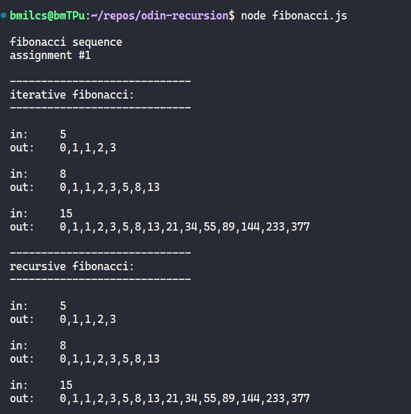
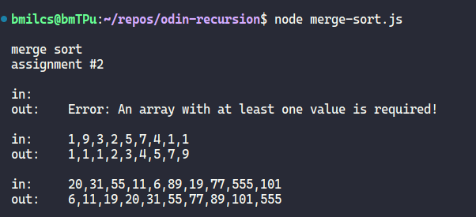

# Odin Project #13: Recursion

Welcome to Bryan Miller's Recursion Project, the [thirteenth assignment](https://www.theodinproject.com/lessons/javascript-recursion) within the Odin Project curriculum. The goal of this repo is to practice the following skill sets:

- Computer Science
- Recursive Functions
  - Fibonacci Sequence
  - Merge Sort

## Summary

Of all topics covered in the Odin Project, I feel **recursion** is by far the most challenging concept to grasp and utilize. Completing this assignment was a humbling experience.

The Fibonacci Sequence functions weren't too bad and I was able to hammer them out on my own. Merge Sort, on the other hand, required a lot of research and struggling. Ultimately, I was able to finish the assignment with the help of others.

## Screenshots

> Fibonacci Sequence Output



> Merge Sort Output



## Links

- [My Odin Project Progress](https://github.com/bmilcs/odin-project)

## Deployment

```sh
# clone repo
git clone https://github.com/bmilcs/odin-recursion

# run scripts:
node fibonacci.js
node merge-sort.js
```
